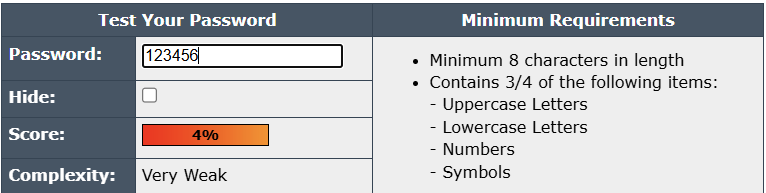
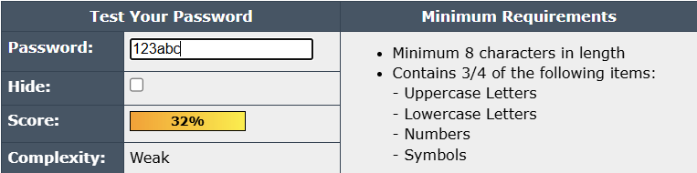
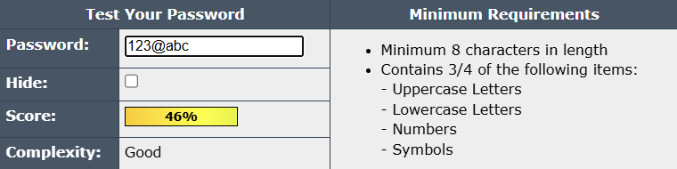
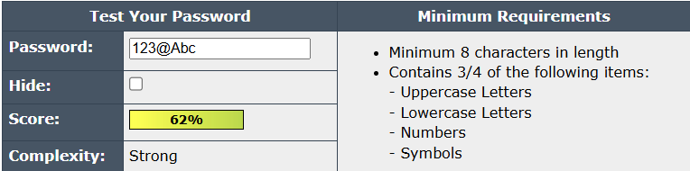
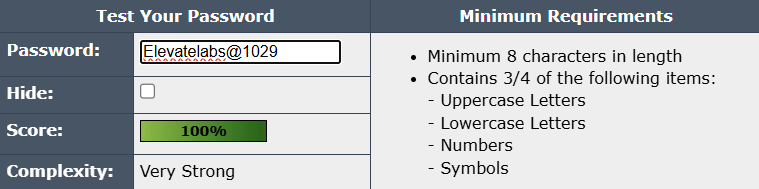

# Cybersecurity Internship-Task 6
# Create a Strong Password and Evaluate its Strength

## 🎯 Objective

To understand the characteristics that make a password strong and evaluate its strength using online password strength tools.

## 🧪 Methodology

### **Tools Used:**

- [Password Meter](https://www.passwordmeter.com/)

### **Password Samples Tested:**

### a) Very Weak

### b) Weak

### c) Good

### d) Strong

### b) Very Strong

## 🧠 Analysis

### What Makes a Password Strong?

A strong password typically has:

- **Length**: ≥ 12 characters
- **Character Variety**: Mix of uppercase, lowercase, digits, and special characters
- **Unpredictability**: No common words, patterns, or reused passwords
- **Randomness**: Ideally, generated by a password manager or passphrase generator

### Weak Password Pitfalls

- Short length
- Common words or sequences (like `123456`, `qwerty`)
- Leetspeak replacements alone aren’t enough (`P@ssword`)
- Keyboard patterns (`asdfgh`, `qwerty`) are easily guessed

---

## ✅ Recommendations

- Use passphrases (e.g., `Elevatelabs@1029`) — easy to remember but hard to crack
- Consider password managers for generating and storing complex passwords
- Avoid reusing passwords across services
- Enable two-factor authentication (2FA) wherever possible
